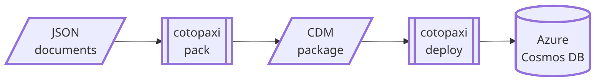

# cotopaxi

<p />

## About

<p />

A toolset for deploying data to Azure Cosmos DB as part of a cloud-native application, designed for straightforward integration with CI/CD pipelines. The package format is based on Microsoft Common Data Model (CDM) and ECMA-376 (Open Packaging Conventions).

<p />



<p />

Packing the database documents specified in a database package project (an example with Azure Pipelines):

<p />

```txt
$ dotnet tool run cotopaxi pack $(Build.SourcesDirectory)/adventureworks.json $(Build.StagingDirectory)/adventureworks.cdbpkg
/home/vsts/work/1/s/adventureworks/products/bikes.json:$[0]: upsert adventureworks\products\3202cb6f-42af-4fe6-a3c5-d61927721e75 (4)
/home/vsts/work/1/s/adventureworks/products/bikes.json:$[1]: upsert adventureworks\products\e1894e24-550d-4fe3-9784-47d614600baa (4)
```

<p />

Deploying the created database package to a configured Azure Cosmos DB account (an example with Azure Pipelines):

<p />

```txt
$ dotnet tool run cotopaxi deploy $(System.ArtifactsDirectory)/**/*.cdbpkg
/home/vsts/work/r1/a/adventureworks.cdbpkg >>> https://adventureworks.documents.azure.com:443
upsert adventureworks\products\3202cb6f-42af-4fe6-a3c5-d61927721e75 ["bikes"]: HTTP 200 (6.67 RU)
upsert adventureworks\products\e1894e24-550d-4fe3-9784-47d614600baa ["bikes"]: HTTP 200 (6.67 RU)
```

<p />

## References

<p />

- [Microsoft - Common Data Model](https://learn.microsoft.com/en-us/common-data-model)
- [ECMA International - ECMA-376](https://ecma-international.org/publications-and-standards/standards/ecma-376)
