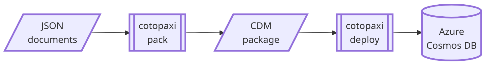

# cotopaxi

<p />

## About

<p />

A toolset for deploying data to Azure Cosmos DB as part of a cloud-native application, designed for straightforward integration with CI/CD pipelines. The package format is based on Microsoft Common Data Model (CDM) and ECMA-376 (Open Packaging Conventions).

<p />



<p />

Packing the database documents specified in a database package project (an example with Azure Pipelines):

<p />

```txt
$ dotnet tool run cotopaxi pack $(Build.SourcesDirectory)/adventureworks.json $(Build.StagingDirectory)/adventureworks-v1.0.0.cdbpkg
Packing /home/vsts/work/1/s/adventureworks/products/bikes.json:$[0] for upsert in adventureworks\products
Packing /home/vsts/work/1/s/adventureworks/products/bikes.json:$[1] for upsert in adventureworks\products
```

<p />

Deploying the created database package to a configured Azure Cosmos DB account (an example with Azure Pipelines):

<p />

```txt
$ dotnet tool run cotopaxi deploy $(System.ArtifactsDirectory)/**/*.cdbpkg
Deploying package /home/vsts/work/r1/a/adventureworks-v1.0.0.cdbpkg to endpoint https://adventureworks.documents.azure.com:443
Executing upsert cdbpkg:dfcf04cb-886e-ae82-9172-fa4a1acb5d8b:$[0] in adventureworks\products - HTTP 200
Executing upsert cdbpkg:dfcf04cb-886e-ae82-9172-fa4a1acb5d8b:$[1] in adventureworks\products - HTTP 200
```

<p />

## References

<p />

- [Microsoft - Common Data Model](https://learn.microsoft.com/en-us/common-data-model)
- [ECMA International - ECMA-376](https://ecma-international.org/publications-and-standards/standards/ecma-376)
